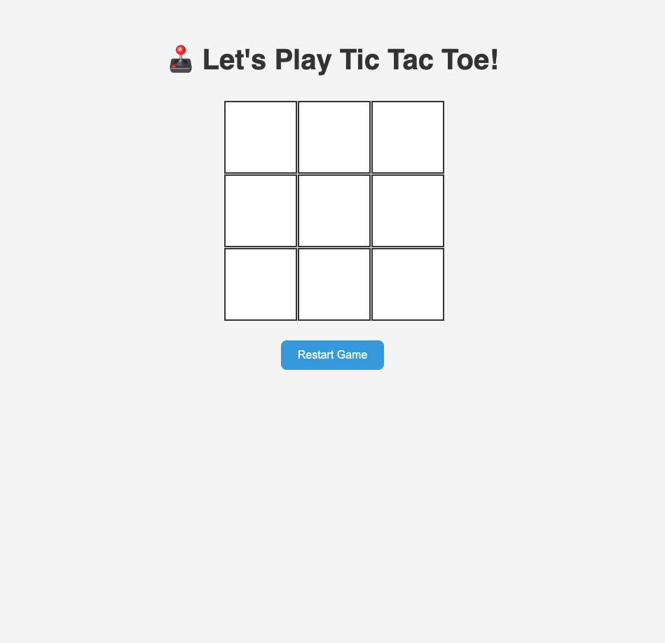

# tic-tac-toe ⭕❌

A simple browser-based Tic Tac Toe game built with **HTML**, **CSS**, and **JavaScript**.

This project is great for beginners who want to learn:
- DOM manipulation
- Event handling
- Game state management
- Basic logic implementation in JavaScript

---

## 🚀 How to Use

1. Clone or download the repository.
2. Open `index.html` in your browser.
3. Click on the grid to play as X and O.
4. Use the **Restart Game** button to start over.

---

## 💡 Features

- 3x3 interactive game board
- Two-player mode (X and O)
- Turn-based switching
- Reset button functionality

---

## 🖼️ Screenshot

---

## 📁 Project Structure

tic-tac-toe/
├── index.html
├── css/
│   └── style.css
├── js/
│   └── script.js
├── assets/
│   └── screenshot.png
└── README.md

---

## 🖼️ Screenshot

---

Built with ❤️ while learning JavaScript.